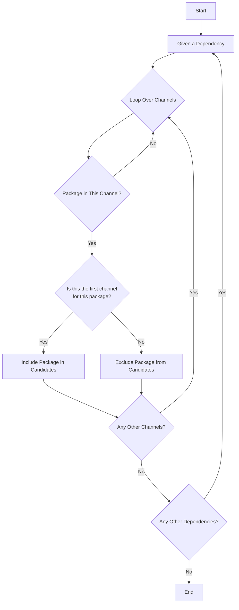
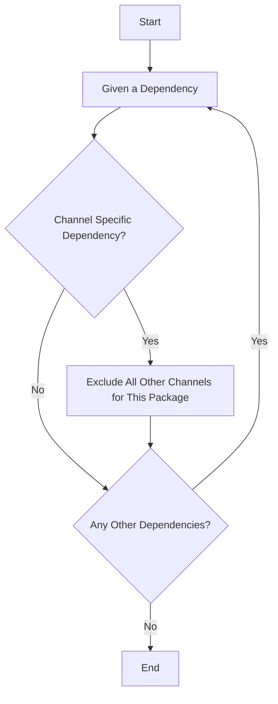

Pixi implements strict channel priority to ensure reproducible builds and predictable dependency resolution. Understanding how channel priority works is crucial for complex multi-channel setups.

## How Channel Priority Works

Channel priority is dictated by the order in the `workspace.channels` array, where the **first channel has the highest priority**.

```toml
[workspace]
channels = ["conda-forge", "pytorch", "nvidia"]
```

In this example:
1. `conda-forge` has the highest priority
2. `pytorch` has medium priority
3. `nvidia` has the lowest priority

## Priority Logic

The solver uses the following logic when resolving packages:



### Example: Package Resolution

With channels: `["conda-forge", "my-channel", "your-channel"]`

- If package is found in `conda-forge`, the solver **excludes** it from `my-channel` and `your-channel`
- If NOT found in `conda-forge`, but found in `my-channel`, the solver **excludes** it from `your-channel`
- If only in `your-channel`, that version is used

<Note>
  This ensures packages always come from the highest-priority channel available, preventing version conflicts.
</Note>

## Channel-Specific Dependencies

You can pin individual dependencies to specific channels:

```toml
[workspace]
channels = ["conda-forge", "my-channel"]

[dependencies]
packagex = { version = "*", channel = "my-channel" }
```

The solver will **only** look for `packagex` in `my-channel`, even though `conda-forge` has higher priority.



## Explicit Priority Values

For advanced scenarios (especially with multiple environments), you can set explicit priority values:

<ParamField path="channel.priority" type="integer" default="0">
  Higher numbers = higher priority. Non-specified channels use their array index.
</ParamField>

```toml
[workspace]
channels = [
  "conda-forge",
  { channel = "pytorch", priority = 10 },
  { channel = "nvidia", priority = 5 }
]
```

Effective priority order:
1. `pytorch` (priority 10)
2. `nvidia` (priority 5)
3. `conda-forge` (priority 0, first in array)

## Multi-Environment Channel Priority

When using features with different channels, priority becomes more complex:

```toml
[workspace]
channels = ["conda-forge"]

[feature.cuda]
channels = ["nvidia", { channel = "pytorch", priority = 1 }]

[feature.cpu]
channels = ["pytorch", { channel = "nvidia", priority = -1 }]

[environments]
default = []
cuda = ["cuda"]
cpu = ["cpu"]
```

Resulting channel order:

| Environment | Channels Order |
|-------------|----------------|
| default | `conda-forge` |
| cuda | `pytorch`, `nvidia`, `conda-forge` |
| cpu | `pytorch`, `conda-forge`, `nvidia` |

<Note>
  Feature channels are prepended to workspace channels by default. Use explicit priorities to control order.
</Note>

## Use Case: PyTorch with CUDA

A common scenario is using PyTorch with NVIDIA CUDA drivers:

```toml
[workspace]
channels = ["nvidia/label/cuda-11.8.0", "nvidia", "conda-forge", "pytorch"]
platforms = ["linux-64"]

[dependencies]
cuda = { version = "*", channel = "nvidia/label/cuda-11.8.0" }
pytorch = { version = "2.0.1.*", channel = "pytorch" }
torchvision = { version = "0.15.2.*", channel = "pytorch" }
pytorch-cuda = { version = "11.8.*", channel = "pytorch" }
python = "3.10.*"
```

### Why This Works

1. **CUDA packages** from `nvidia/label/cuda-11.8.0` (highest priority)
2. **NVIDIA packages** (like `cuda-cudart`) from `nvidia` channel
3. **Most dependencies** from `conda-forge` (broad compatibility)
4. **PyTorch packages** from `pytorch` channel (explicitly pinned)

<Note>
  PyTorch channel is listed last because we want most dependencies from conda-forge. We explicitly pin PyTorch packages to the pytorch channel to avoid issues.
</Note>

### Why Not Put PyTorch First?

The `pytorch` channel ships outdated versions of some packages (e.g., old `ffmpeg`) that break newer PyTorch. By keeping `conda-forge` first and explicitly pinning PyTorch packages, we get:

- Latest compatible dependencies from conda-forge
- PyTorch packages from the official channel
- No conflicts from outdated pytorch channel packages

## Check Channel Priority

Use `pixi info` to verify channel order for your environments:

```bash
pixi info
```

Output:

```
Environments
------------
       Environment: default
          Features: default
          Channels: conda-forge
Dependency count: 0
Target platforms: linux-64

       Environment: cuda
          Features: cuda, default
          Channels: nvidia, pytorch, conda-forge
Dependency count: 4
Target platforms: linux-64
```

## Common Patterns

### Pattern 1: Conda-forge First

Most projects should start with conda-forge:

```toml
[workspace]
channels = ["conda-forge"]
```

### Pattern 2: Specialized Channel for Specific Packages

```toml
[workspace]
channels = ["conda-forge", "bioconda"]

[dependencies]
bwa = { version = "*", channel = "bioconda" }
samtools = { version = "*", channel = "bioconda" }
numpy = "*"  # From conda-forge
```

### Pattern 3: Multiple Specialized Channels

```toml
[workspace]
channels = ["pytorch", "nvidia", "conda-forge"]

[dependencies]
pytorch = { version = "*", channel = "pytorch" }
cuda = { version = "*", channel = "nvidia" }
pandas = "*"  # From highest priority channel that has it
```

### Pattern 4: Environment-Specific Channels

```toml
[workspace]
channels = ["conda-forge"]

[feature.gpu]
channels = [{ channel = "nvidia", priority = 10 }]

[feature.cpu]
channels = []

[environments]
gpu = ["gpu"]
cpu = ["cpu"]
```

## Mirrors and Channel Priority

Channel mirrors don't change priority logic:

```toml
[mirrors]
"https://conda.anaconda.org/conda-forge" = [
  "https://prefix.dev/conda-forge",
  "https://conda.anaconda.org/conda-forge"
]
```

The mirror is treated as the same channel for priority purposes.

## Troubleshooting

### Wrong Package Version

If you're getting an unexpected version:

1. Check channel order with `pixi info`
2. Verify package exists in expected channel
3. Use channel-specific dependency if needed

```bash
# Check which channel provides a package
pixi search numpy --channel conda-forge
pixi search numpy --channel pytorch
```

### Dependency Conflicts

If solver fails with conflicts:

1. Check if packages require incompatible dependencies from different channels
2. Try reordering channels
3. Pin problematic packages to specific channels
4. Use explicit priority values

### Unexpected Channel Selection

```bash
# Show detailed solver information
pixi install -vvv
```

This shows which channels are considered for each package.

## Best Practices

1. **Start with conda-forge** unless you have specific requirements
2. **Use channel-specific dependencies** for packages that must come from a particular source
3. **Document channel rationale** in comments for team members
4. **Test channel order** with `pixi info` before committing
5. **Use explicit priorities** for complex multi-environment setups
6. **Minimize channel count** to reduce solver complexity
7. **Pin critical packages** to specific channels for reproducibility

<Warning>
  Adding many channels can significantly slow down dependency resolution. Only add channels you actually need.
</Warning>
