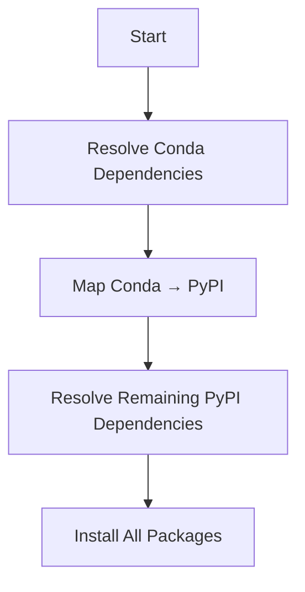

Pixi is built on top of both the conda and PyPI ecosystems, providing seamless integration between the two largest package repositories. Understanding how they work together is key to using Pixi effectively.

## The Two Ecosystems

### Conda Ecosystem

**Conda** is a cross-platform, cross-language package ecosystem widely used in data science and scientific computing.

**Key characteristics:**
- **Binary packages** - No compilation needed, fast installation
- **Cross-language** - Python, R, C++, Julia, and more
- **System dependencies** - Handles compilers, libraries, tools
- **Reproducible** - Exact builds with hashes

**Main channels:**
- [conda-forge](https://prefix.dev/channels/conda-forge) - Community-driven, 20,000+ packages
- [bioconda](https://prefix.dev/channels/bioconda) - Bioinformatics packages
- [nvidia](https://conda.anaconda.org/nvidia) - CUDA and GPU packages

### PyPI Ecosystem

**PyPI** (Python Package Index) is the main package index for Python.

**Key characteristics:**
- **Source and wheels** - Source distributions or pre-built wheels
- **Python-only** - Focused on Python packages
- **Large ecosystem** - 500,000+ packages, lower barrier to entry
- **Variable quality** - Wider range of package quality

**Package format:**
- Source distributions (sdist) - Require compilation
- Wheels - Pre-built binary packages

## Tool Comparison

| Feature | Conda | PyPI |
|---------|-------|------|
| Package format | Binary | Source & Binary (wheel) |
| Package managers | [`conda`](https://github.com/conda/conda), [`mamba`](https://github.com/mamba-org/mamba), [`micromamba`](https://github.com/mamba-org/mamba), [`pixi`](https://github.com/prefix-dev/pixi) | [`pip`](https://github.com/pypa/pip), [`uv`](https://github.com/astral-sh/uv), [`poetry`](https://github.com/python-poetry/poetry), [`pdm`](https://github.com/pdm-project/pdm), [`pixi`](https://github.com/prefix-dev/pixi) |
| Environment management | [`conda`](https://github.com/conda/conda), [`mamba`](https://github.com/mamba-org/mamba), [`pixi`](https://github.com/prefix-dev/pixi) | [`venv`](https://docs.python.org/3/library/venv.html), [`virtualenv`](https://virtualenv.pypa.io/), [`uv`](https://github.com/astral-sh/uv), [`pixi`](https://github.com/prefix-dev/pixi) |
| Package building | [`conda-build`](https://github.com/conda/conda-build), [`pixi`](https://github.com/prefix-dev/pixi) | [`setuptools`](https://github.com/pypa/setuptools), [`hatch`](https://github.com/pypa/hatch), [`uv`](https://github.com/astral-sh/uv), [`poetry`](https://github.com/python-poetry/poetry) |
| Package index | [conda-forge](https://prefix.dev/channels/conda-forge), [bioconda](https://prefix.dev/channels/bioconda) | [pypi.org](https://pypi.org) |

## Pixi's Integration: uv by Astral

Pixi uses the [`uv`](https://github.com/astral-sh/uv) library from [Astral](https://astral.sh) to handle PyPI packages.

<Info>
Pixi doesn't install `uv` as a separate tool - both are built in Rust and `uv` is used as a library.
</Info>

We're grateful to the Astral team for their excellent work on `uv`, which enables fast and reliable PyPI package handling. Pixi originally built a library called `rip` for PyPI support, but switched to `uv` as it matured.

**Background:**
- [Initial rip announcement](https://prefix.dev/blog/pypi_support_in_pixi)
- [Switching to uv](https://prefix.dev/blog/uv_in_pixi)

## The Conda-First Approach

Pixi uses a **conda-first approach** to resolve dependencies:



### Resolution Process

1. **Conda resolution** - Solve all conda dependencies first
2. **Package mapping** - Map conda packages to their PyPI equivalents
3. **PyPI resolution** - Solve remaining PyPI dependencies
4. **Installation** - Install all packages together

<Tip>
If a package is specified in both `[dependencies]` and `[pypi-dependencies]`, Pixi installs the conda version.
</Tip>

### Example: Overlapping Dependencies

```toml
[dependencies]
python = ">=3.8"
numpy = ">=1.21.0"

[pypi-dependencies]
numpy = ">=1.21.0"  # This will be ignored
```

Result:

```bash
pixi list -x
# Package  Version  Build               Size      Kind   Source
# numpy    2.3.0    py313h41a2e72_0     6.2 MiB   conda  conda-forge
# python   3.13.5   hf3f3da0_102_cp313  12.3 MiB  conda  conda-forge
```

Numpy is installed from conda, not PyPI.

### Example: PyPI-Only Package

```toml
[dependencies]
python = ">=3.8"

[pypi-dependencies]
numpy = ">=1.21.0"  # Not in conda dependencies
```

Result:

```bash
pixi list --explicit
# Package  Version  Build               Size      Kind   Source
# numpy    2.3.1                        43.8 MiB  pypi   numpy-2.3.1-cp313-cp313-macosx_11_0_arm64.whl
# python   3.13.5   hf3f3da0_102_cp313  12.3 MiB  conda  conda-forge
```

Numpy is installed from PyPI because it's not in conda dependencies.

## The Two Solvers

Pixi uses two different dependency solvers:

**Conda Solver: [`resolvo`](https://github.com/prefix-dev/resolvo)**
- Implemented in [`rattler`](https://github.com/conda/rattler)
- SAT solver for conda packages
- Handles complex constraint satisfaction

**PyPI Solver: [`PubGrub`](https://github.com/pubgrub-rs/pubgrub)**
- Implemented in [`uv`](https://github.com/astral-sh/uv)
- Modern dependency resolution algorithm
- Lazy metadata resolution for speed

<Note>
The goal is to eventually have a single unified solver (`resolvo`) that handles both ecosystems.
</Note>

### Why Conda First?

PyPI packages need a base environment to install into:

- Python interpreter (from conda)
- System libraries (from conda)
- Compilers (from conda, if needed)

Conda packages provide this base, then PyPI packages build on top.

## Package Mapping

Pixi uses [`parselmouth`](https://github.com/prefix-dev/parselmouth) to map conda packages to their PyPI equivalents.

**Example mapping:**
- Conda `numpy` → PyPI `numpy`
- Conda `py-cpuinfo` → PyPI `py-cpuinfo`
- Conda `python` → No PyPI equivalent (it IS Python)

Customize mapping in `pixi.toml`:

```toml
[conda-pypi-map]
custom-package = [{ conda = "conda-pkg-name", pypi = "pypi-pkg-name" }]
```

## Common Issue: Pinned Package Conflicts

When mixing conda and PyPI dependencies, you might see:

```toml
[dependencies]
typing_extensions = "*"  # Latest conda version

[pypi-dependencies]
typing_extensions = "==4.14"  # Specific PyPI version
```

Error:

```
Error: failed to solve the pypi requirements of environment 'default'
├─▶ failed to resolve pypi dependencies
╰─▶ Because you require typing-extensions==4.14 and typing-extensions==4.15.0,
    we can conclude that your requirements are unsatisfiable.
help: The following PyPI packages have been pinned by the conda solve:
      typing-extensions==4.15.0
```

**What happened:**
1. Conda solver chose latest `typing_extensions` (4.15.0)
2. PyPI solver tried to install 4.14
3. Conflict! Both can't be installed

**Solution:** Constrain the conda package:

```toml
[dependencies]
typing_extensions = "<4.15"  # Match PyPI constraint

[pypi-dependencies]
typing_extensions = "==4.14"
```

<Warning>
This is a common pitfall of the two-stage solve. Always ensure conda constraints are compatible with PyPI constraints.
</Warning>

### Indirect Dependencies

Conflicts can also occur through transitive dependencies:

```toml
[dependencies]
some-conda-package = "*"  # Depends on typing-extensions

[pypi-dependencies]
some-pypi-package = "==0.1.0"  # Depends on typing-extensions<4.15
```

Error:

```
Error: failed to solve the pypi requirements
╰─▶ Because some-pypi-package==0.1.0 depends on typing-extensions<4.15
    and typing-extensions==4.15.0, we can conclude that
    some-pypi-package==0.1.0 cannot be used.
help: The following PyPI packages have been pinned by the conda solve:
      typing-extensions==4.15.0
```

**Solution:** Add explicit constraint:

```toml
[dependencies]
some-conda-package = "*"
typing_extensions = "<4.15"  # Match PyPI package needs

[pypi-dependencies]
some-pypi-package = "==0.1.0"
```

## Best Practices

### Prefer Conda When Available

```toml
# Good: Fast binary installs
[dependencies]
python = ">=3.9"
numpy = ">=1.21"
scipy = ">=1.7"
pandas = ">=1.3"

# Add PyPI only when necessary
[pypi-dependencies]
special-tool = "*"  # Not available in conda
```

<Tip>
Conda packages are generally faster to install and more reproducible than PyPI packages that need compilation.
</Tip>

### Use PyPI for Development Tools

```toml
[dependencies]
# Scientific stack from conda
python = ">=3.9"
numpy = "*"
pandas = "*"

[pypi-dependencies]
# Development tools from PyPI (latest versions)
black = "*"
ruff = "*"
mypy = "*"
pytest = "*"
```

### Match Constraints Across Ecosystems

```toml
[dependencies]
# Ensure conda version is compatible
pydantic = ">=2.0,<3.0"

[pypi-dependencies]
# PyPI package that needs pydantic
fastapi = ">=0.100"  # Requires pydantic v2
```

### Separate by Purpose

```toml
[dependencies]
# Core runtime dependencies from conda
python = "3.11.*"
numpy = ">=1.24"
pandas = ">=2.0"

[pypi-dependencies]
# Application-specific packages from PyPI
fastapi = ">=0.100"
uvicorn = "*"
sqlalchemy = ">=2.0"
```

## Real-World Example

Machine learning project using both ecosystems:

```toml
[workspace]
name = "ml-project"
channels = ["conda-forge", "pytorch"]
platforms = ["linux-64", "osx-arm64"]

[dependencies]
# Python and scientific stack from conda (binary, fast)
python = "3.11.*"
numpy = ">=1.24"
scipy = ">=1.11"
pandas = ">=2.0"
matplotlib = ">=3.7"
scikit-learn = ">=1.3"

# PyTorch from conda with CUDA support
pytorch = { version = "2.0.*", channel = "pytorch" }
torchvision = { version = "0.15.*", channel = "pytorch" }

[pypi-dependencies]
# ML frameworks and tools from PyPI (latest versions)
transformers = ">=4.30"
datasets = ">=2.14"
wandb = ">=0.15"  # Experiment tracking
streamlit = ">=1.25"  # Web UI

# Development tools
black = "*"
ruff = "*"
pytest = "*"
```

This setup:
- Uses conda for core scientific packages (faster, binary)
- Uses PyPI for specialized ML tools (latest versions)
- Separates development tools in PyPI
- Ensures CUDA support via conda packages

## Troubleshooting

**Problem: Package installed from wrong ecosystem**

```bash
pixi list | grep numpy
# Shows PyPI when you wanted conda
```

**Solution:** Add to conda dependencies:

```toml
[dependencies]
numpy = "*"  # Now comes from conda

# Remove or keep in pypi-dependencies (will be ignored)
```

**Problem: Conflicting versions**

```
Error: typing-extensions pinned by conda at 4.15.0 conflicts with PyPI requirement ==4.14
```

**Solution:** Align conda constraint:

```toml
[dependencies]
typing-extensions = "<4.15"
```

**Problem: Slow PyPI installs**

**Solution:** Move packages to conda when possible:

```toml
# Slow: PyPI source build
# [pypi-dependencies]
# scipy = "*"

# Fast: Conda binary
[dependencies]
scipy = "*"
```

## Further Reading

- [uv Documentation](https://docs.astral.sh/uv/)
- [Conda Package Specifications](./package-specifications.mdx)
- [Rattler Resolver Blog](https://prefix.dev/blog/the_new_rattler_resolver)
- [UV Unified Python Packaging](https://astral.sh/blog/uv-unified-python-packaging)
