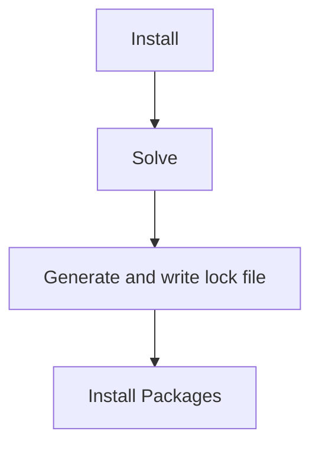
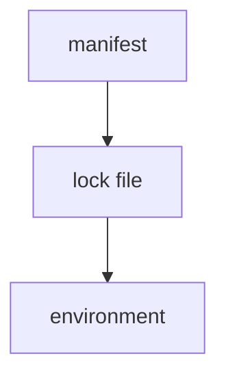

> A lock file is the protector of the environments, and Pixi is the key to unlock it.

The lock file is crucial for creating reproducible environments. It captures the exact state of your environment, ensuring everyone working on your project uses identical package versions.

## What is a Lock File?

A lock file locks the environment in a specific state. In Pixi, the `pixi.lock` file contains two main definitions:

### 1. Environment Definitions

Lists all packages for each environment and platform:

```yaml
environments:
    default:
        channels:
          - url: https://conda.anaconda.org/conda-forge/
        packages:
            linux-64:
            ...
            - conda: https://conda.anaconda.org/conda-forge/linux-64/python-3.12.2-hab00c5b_0_cpython.conda
            ...
            osx-64:
            ...
            - conda: https://conda.anaconda.org/conda-forge/osx-64/python-3.12.2-h9f0c242_0_cpython.conda
            ...
```

### 2. Package Definitions

Complete metadata for each package:

```yaml
- kind: conda
  name: python
  version: 3.12.2
  build: h9f0c242_0_cpython
  subdir: osx-64
  url: https://conda.anaconda.org/conda-forge/osx-64/python-3.12.2-h9f0c242_0_cpython.conda
  sha256: 7647ac06c3798a182a4bcb1ff58864f1ef81eb3acea6971295304c23e43252fb
  md5: 0179b8007ba008cf5bec11f3b3853902
  depends:
    - bzip2 >=1.0.8,<2.0a0
    - libexpat >=2.5.0,<3.0a0
    - libffi >=3.4,<4.0a0
    - libsqlite >=3.45.1,<4.0a0
    - libzlib >=1.2.13,<1.3.0a0
    - ncurses >=6.4,<7.0a0
    - openssl >=3.2.1,<4.0a0
    - readline >=8.2,<9.0a0
    - tk >=8.6.13,<8.7.0a0
    - tzdata
    - xz >=5.2.6,<6.0a0
  constrains:
    - python_abi 3.12.* *_cp312
  license: Python-2.0
  size: 14596811
  timestamp: 1708118065292
```

## Why Use a Lock File?

Pixi uses lock files for several critical reasons:

**Save Environment State**
- Captures complete environment without copying all files
- Enables quick environment recreation
- Much smaller than container images

**Ensure Consistency**
- Guarantees workspace configuration matches environment
- Prevents "works on my machine" problems
- Aligns with your `pixi.toml` manifest

**Enable Collaboration**
- Colleagues get identical environments
- No dependency resolution conflicts
- Reduces onboarding friction

**Support Reproducibility**
- Run the same environment across machines
- Critical for CI/CD systems
- Easy rollback to working states

<Tip>
Using lock files makes tools like Docker less necessary for reproducibility.
</Tip>

## When is a Lock File Generated?

The lock file is generated during the solve step of package installation:



These commands automatically update the lock file when dependencies change:

- `pixi install`
- `pixi run`
- `pixi shell`
- `pixi shell-hook`
- `pixi tree`
- `pixi list`
- `pixi add`
- `pixi remove`

<Info>
The lock file is always kept in sync with your `pixi.toml` or `pyproject.toml` manifest.
</Info>

## How to Use the Lock File

<Warning>
Do not edit the lock file manually! It is a machine-only file.
</Warning>

The `pixi.lock` is human-readable, making it easy to track changes in version control:

```bash
# Track in git
git add pixi.lock
git commit -m "Update dependencies"
```

### Lock File Options

All environment commands support lock file usage options:

**Frozen Mode**
```bash
# Use exact lock file, don't update even if manifest changed
pixi install --frozen
pixi run --frozen test

# Via environment variable
export PIXI_FROZEN=true
pixi install
```

**Locked Mode**
```bash
# Only install if lock file is up-to-date with manifest
pixi install --locked
pixi run --locked test

# Via environment variable
export PIXI_LOCKED=true
pixi install
```

<Note>
`--frozen` is useful in CI/CD to ensure exact reproducibility. `--locked` fails fast if lock file is out of sync.
</Note>

### Syncing Lock File with Manifest

The lock file must match the complete manifest configuration:



When you change `pixi.toml`, Pixi automatically updates the lock file:

```bash
# After modifying pixi.toml
pixi install  # Updates lock file if needed
```

## Lock File Satisfiability

Pixi checks if the lock file is "satisfiable" - meaning the manifest, lock file, and environment are in sync.

### Satisfiability Checks

- All environments in manifest exist in lock file
- All channels in manifest exist in lock file
- All packages in manifest are in lock file with compatible versions
- Package versions match manifest requirements (uses conda matchspecs)
- For PyPI dependencies, all Python conda packages have `purls` fields
- All hashes for editable PyPI packages are correct
- Only one entry per package exists

<Info>
If the lock file is not satisfiable, Pixi automatically generates a new one.
</Info>

## Lock File Version

The lock file includes a version for compatibility:

```yaml
version: 6
```

Pixi is **backward compatible** but **not forward compatible**:

- ✅ Newer Pixi can use older lock files
- ❌ Older Pixi cannot use newer lock files

<Warning>
Always use Pixi versions that support your lock file version.
</Warning>

## Lock File Size

Lock files can grow large with many packages, but:

1. Pixi optimizes for minimal size
2. Lock files are always smaller than Docker images
3. Downloading a small lock file is faster than downloading wrong packages
4. The size ensures complete reproducibility

<Accordion title="Is your lock file too large?">
If lock file size is a concern:

- It's still smaller than equivalent container images
- Download time is minimal compared to package downloads
- The completeness prevents costly dependency resolution errors
- Consider it a small price for guaranteed reproducibility
</Accordion>

## When You Don't Need a Lock File

You might skip lock files if:

- You don't need reproducible environments
- You're always building from scratch
- You're experimenting with package versions

But consider these benefits:

**CI Systems**
```yaml
# .github/workflows/test.yml
- name: Install dependencies
  run: pixi install --frozen
```

The lock file ensures CI uses the exact same packages you tested locally.

**Team Collaboration**
```bash
# New team member
git clone repo
pixi install  # Gets exact environment from lock file
pixi run test # Works immediately
```

No more "Did you try version X?" or "Works on my machine."

**Rollback Safety**
```bash
git checkout previous-commit
pixi install  # Restores working environment
```

Instantly return to a known-good state.

## Removing the Lock File

You can delete the lock file to force a fresh solve:

```bash
rm pixi.lock
pixi install  # Generates new lock file
```

<Warning>
Removing the lock file updates all packages to their latest compatible versions. You may lose the exact working state.
</Warning>

## Best Practices

**Always Commit Lock Files**
```bash
git add pixi.lock pixi.toml
git commit -m "Add numpy dependency"
```

**Use Frozen in CI**
```yaml
# .github/workflows/ci.yml
- run: pixi install --frozen
- run: pixi run test
```

**Review Lock File Changes**
```bash
git diff pixi.lock
# Check which package versions changed
```

**Force Fresh Solve**
```bash
rm pixi.lock
pixi install
git diff pixi.lock  # Review changes
```

## Example: Multi-Platform Lock File

A lock file for a multi-platform project:

```yaml
version: 6
environments:
  default:
    channels:
      - url: https://conda.anaconda.org/conda-forge/
    packages:
      linux-64:
        - conda: https://conda.anaconda.org/conda-forge/linux-64/python-3.11.0-h1fd4e5f_0.conda
      osx-arm64:
        - conda: https://conda.anaconda.org/conda-forge/osx-arm64/python-3.11.0-h4346755_0.conda
      win-64:
        - conda: https://conda.anaconda.org/conda-forge/win-64/python-3.11.0-h12c1d72_0.conda
```

Each platform gets its exact package build, ensuring consistency everywhere.
